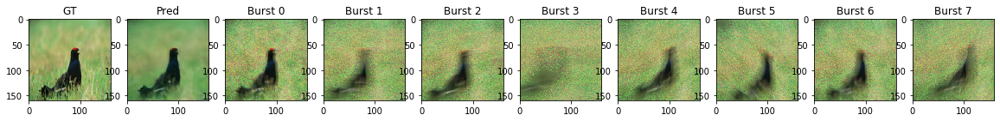

# Burst-Image-Deblurring

This repository contains PyTorch implementations of Burst Image Deblurring Using PermutationInvariant Convolutional Neural Networks from the following paper:
 - "Burst Image Deblurring Using Permutation Invariant Convolutional Neural Networks" Miika Aittala and Fredo Durand, ECCV 2018. [Pdf](http://openaccess.thecvf.com/content_ECCV_2018/papers/Miika_Aittala_Burst_Image_Deblurring_ECCV_2018_paper.pdf), bibtex:

```
@InProceedings{Aittala_2018_ECCV,
author = {Aittala, Miika and Durand, Fredo},
title = {Burst Image Deblurring Using Permutation Invariant Convolutional Neural Networks},
booktitle = {The European Conference on Computer Vision (ECCV)},
month = {September},
year = {2018}
} 
```

This repo includes generation of training data (similar approach as described in paper), training and evaluation of the model.

### How does Burst Image Deblurring work?

The network takes a n long sequence of burst images and outputs 1 sharper image. Each burst image is fed through a siamese Unet with skip connections. After each convelutional block a global max pooling is applied to gather information accross multiple images in the burst image sequence. After the tracks the feature maps are collapsed to a cleaner output image.


### Alterations from orignal model

* We use Radam optimizer instead of Adam as the network seems to require warm-up to converge to a good solution. We conducted several experiments that showed improved performance using the Radam optimizer [Paper](https://arxiv.org/pdf/1908.03265v1.pdf ).
* The data generation might not be exactly identical to the one described in the paper. The procedure described in the paper is rather unclear, however similar looking burst images are generated with our pipeline.

### Results

The network is fed 1..n bursted image and makes a sharper prediction. Below are some qualitive results.




### Instructions

#### Download data
We use imagenet data for the experiments [Download](http://image-net.org/).

#### Training
To train the model simple run
```
python train.py --bs 8 --results '../path_to_output' --data_path '../path_to_data' --epochs 1 --noise_lvl 1 --kernel_lvl 3 --val_size 100 --motion_blur True --homo_align True --max_images 100;
```
To check the training
```
tensorboard --logdir=../path_to_output/runs/
```
#### Evaluation
To evaluate model
```
python eval.py --exp_path '[../path_to_experiments]' --out_path '../path_to_output'
```
